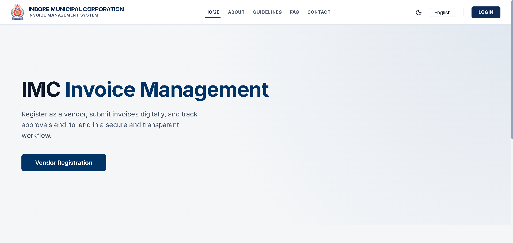
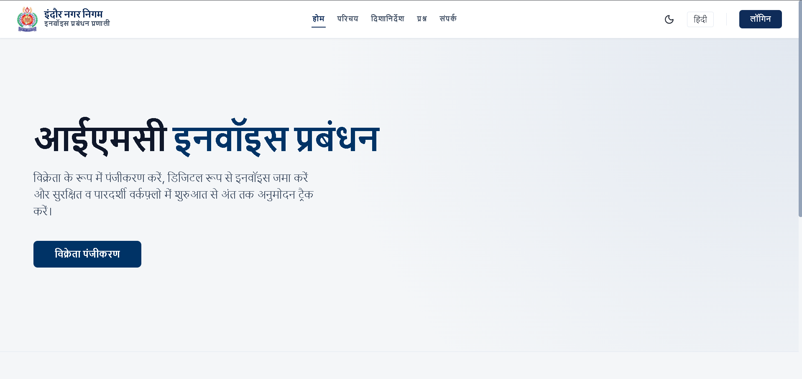
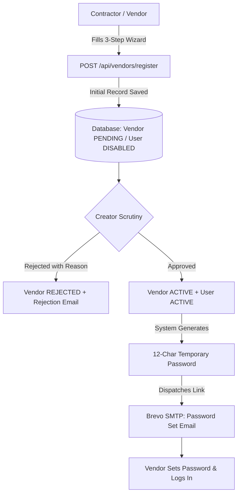
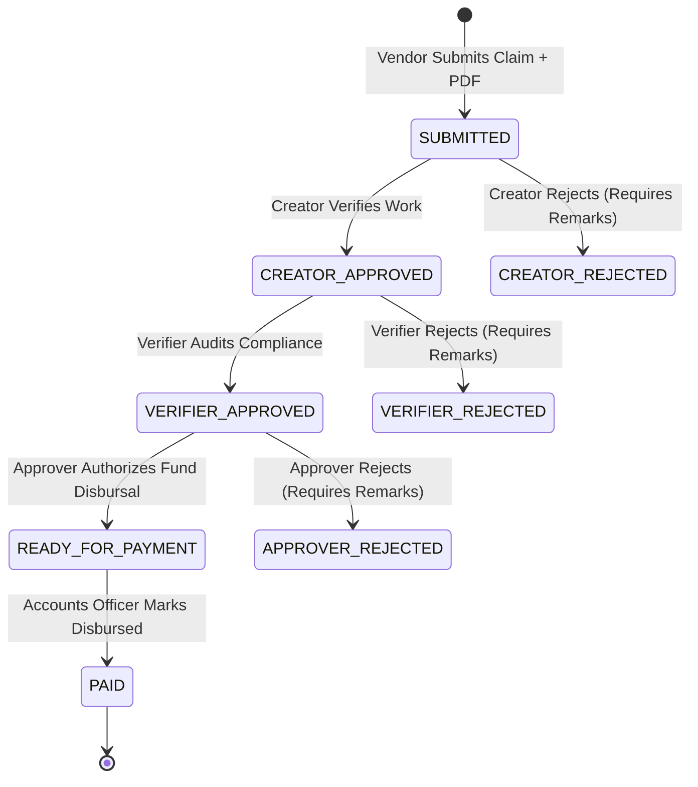
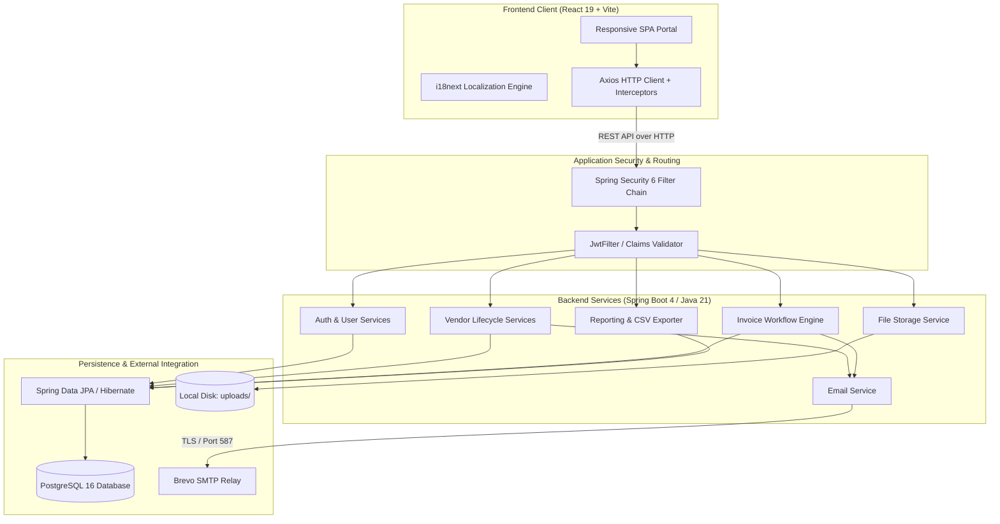
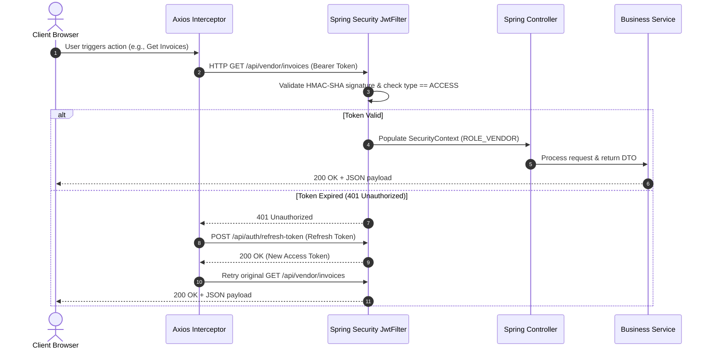
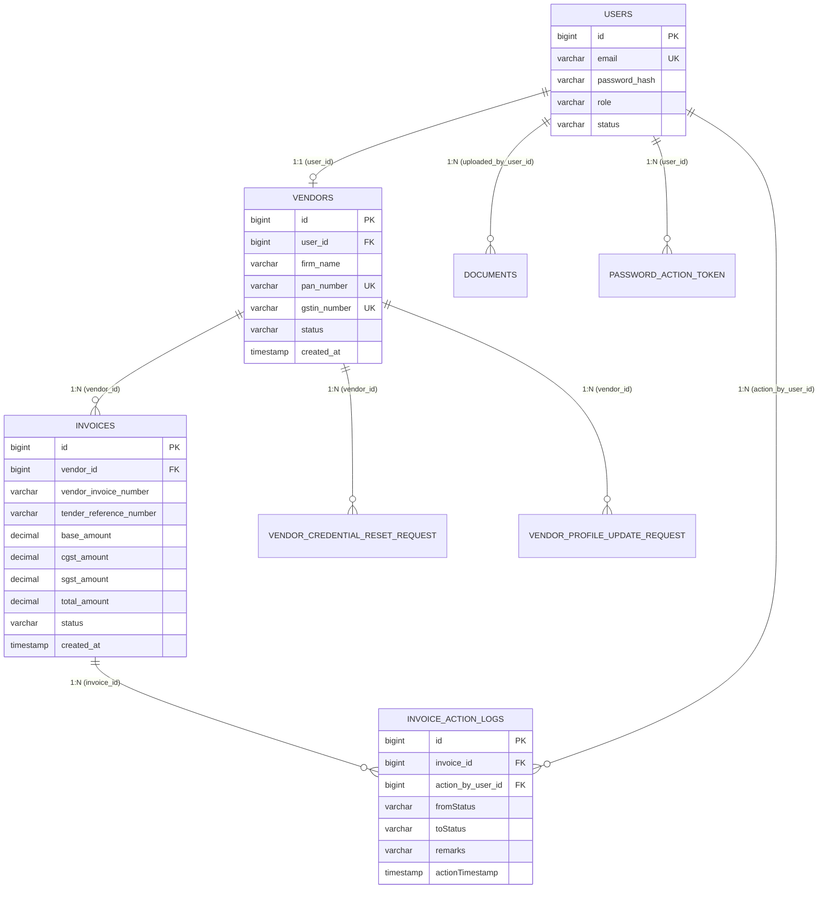

# Indore Municipal Corporation (IMC) — Vendor Management System (VMS)

A full-stack, role-based vendor lifecycle and invoice approval system designed around a municipal governance workflow for Indore Municipal Corporation.

Developed as part of an internship project engagement exploring digital procurement, multi-tier scrutiny, and automated invoice verification for urban local bodies.

---

<p align="center">
  
  
</p>

<p align="center">
  
  
  
  
  
  
  
  
</p>

---

## Table of Contents

- [Overview](#overview)
- [Why This System?](#why-this-system)
- [Business Workflow](#business-workflow)
- [User Roles & Permissions](#user-roles--permissions)
- [Key Features](#key-features)
- [System Architecture](#system-architecture)
- [Technology Stack](#technology-stack)
- [Authentication & Security](#authentication--security)
- [Invoice Processing Lifecycle](#invoice-processing-lifecycle)
- [Email & Notification Pipeline](#email--notification-pipeline)
- [File & Attachment Management](#file--attachment-management)
- [Database Architecture](#database-architecture)
- [API Architecture & Request Lifecycle](#api-architecture--request-lifecycle)
- [Performance & Capacity](#performance--capacity)
- [Screenshots & Visual Tour](#screenshots--visual-tour)
- [Project Directory Structure](#project-directory-structure)
- [Local Setup & Installation](#local-setup--installation)
- [Environment Configuration](#environment-configuration)
- [Testing & Quality Assurance](#testing--quality-assurance)
- [Engineering Challenges & Technical Solutions](#engineering-challenges--technical-solutions)
- [Key Engineering Learnings](#key-engineering-learnings)
- [Project Status & Roadmap](#project-status--roadmap)
- [Project Context & Attribution](#project-context--attribution)
- [Author](#author)

---

## Overview

The **IMC Vendor Management System (VMS)** is a web-based enterprise workflow application designed to digitize and govern the relationship between municipal contractors (vendors) and the municipal administration. It replaces fragmented paper-based and spreadsheet-driven processes with a transparent, audited, sequential pipeline covering:

1. **Vendor Self-Registration & Document Intake** — multi-step registration capturing business credentials (GSTIN, PAN, MSME, bank details, and identification).
2. **Administrative Scrutiny** — municipal officers evaluate submitted profiles, accept or reject with formal reasons, and trigger account provisioning.
3. **GST-Compliant Invoice Submission** — verified vendors lodge claims against allocated tender work orders with auto-calculated split taxes (CGST 9% + SGST 9%).
4. **Three-Tier Sequential Workflow** — claims progress through strict governance checkpoints: **Creator** (initial verification) $\rightarrow$ **Verifier** (compliance audit) $\rightarrow$ **Approver** (disbursement sanction & payment confirmation).
5. **Full Audit Trail & Reporting** — immutable transition logs for every state change and on-demand CSV export for municipal accounts.

---

## Why This System?

Municipal corporations engage thousands of vendors for civic maintenance, civil infrastructure, waste sanitation, and public health. Traditional processing introduces clear operational vulnerabilities:

| Traditional Problem | How IMC VMS Addresses It |
|---|---|
| **Untracked Invoice Submissions** | Vendors receive a transparent real-time status tracker from `SUBMITTED` to `PAID`. |
| **Unauthorized State Jumps** | Backend finite state machine rejects out-of-order transitions at the service layer. |
| **Lack of Accountability** | Every transition records an immutable `InvoiceActionLog` with actor ID, status diff, and remarks. |
| **Tax Calculation Errors** | Base amount entries automatically compute exact 9% CGST and 9% SGST using precision arithmetic. |
| **Weak Public Access** | Fully responsive, mobile-first UI with 100% Hindi/English localization for regional contractors. |

---

## Business Workflow

### 1. Vendor Onboarding Lifecycle



### 2. Invoice Sequential Approval Chain



---

## User Roles & Permissions

The application implements strict Role-Based Access Control (RBAC) separating public contractors from municipal departmental tiers:

| Role | Domain / Scope | Primary Responsibilities |
|---|---|---|
| **VENDOR** | External Contractor | Self-registration, profile maintenance requests, invoice submission with supporting documents, personal claim tracking, and password recovery. |
| **CREATOR** | Municipal Intake / Desk Officer | Primary gatekeeper: scrutinizes incoming vendor registrations (approves/rejects), inspects initial invoice claims, and advances them to the verification desk. |
| **VERIFIER** | Compliance & Audit Officer | Second-tier inspector: reviews creator-cleared invoices against budget sheets, validates tender work completion, and forwards to sanctioning authority. |
| **APPROVER** | Sanctioning Authority / Accounts | Final decision-maker: grants payment clearance (`READY_FOR_PAYMENT`), records financial disbursement (`PAID`), and manages vendor status (Active/Blocked). |

---

## Key Features

### Authentication & Authorization
- **Stateless JWT Security**: Dual-token architecture with short-lived access tokens (15-minute TTL) and refresh tokens (7-day TTL).
- **Dual Transport Support**: Authorization headers (`Bearer <token>`) alongside fallback HttpOnly cookies.
- **In-Memory User Caching**: Client-side session resolution with request de-duplication to eliminate redundant `/auth/me` calls.
- **Hashed Action Tokens**: 64-character SHA-256 hashed one-time tokens for password setup and credential recovery.

### Vendor Management
- **Multi-Step Wizard**: 3-stage validation for firm identity, contact responsibilities, and banking particulars.
- **Regex Format Enforcement**: Strict client and server validation for 10-character PAN (`^[A-Z]{5}[0-9]{4}[A-Z]{1}$`) and 15-character GSTIN (`^[0-9]{2}[A-Z]{5}[0-9]{4}[A-Z]{1}[1-9A-Z]{1}Z[0-9A-Z]{1}$`).
- **Profile Change Requests**: Vendors cannot arbitrarily mutate approved business profiles; updates are submitted as pending requests for Creator review.

### Invoice Lifecycle Management
- **Automatic GST Arithmetic**: Server and client calculation of standard GST rates (9% Central GST + 9% State GST = 18% Total Tax).
- **Vendor-Scoped Uniqueness**: Composite uniqueness prevents duplicate invoice submissions for the same vendor firm.
- **Audit Logging**: Every transition logs actor ID, source status, target status, timestamp, and mandatory remarks on rejection.

### Usability & Accessibility
- **100% Bilingual Parity**: Complete English and Hindi coverage using `react-i18next` across all portals and dialogs.
- **Mobile-First Responsiveness**: Responsive navigation drawer, 44px minimum tap targets, and automatic fallback from dense data tables to card stacks on viewports $< 768\text{px}$.
- **Dual-Mode Theming**: High-contrast light theme and WCAG AA compliant dark theme powered by semantic CSS variables.

### Analytics & Reports
- **Executive Summaries**: Role-specific KPI metrics (Total Submitted, Pending Verification, Ready for Payment, Settled).
- **Dynamic Date & Status Filtering**: Filter claims across 30-day, 90-day, or custom date ranges.
- **Streaming CSV Export**: Direct RFC-4180 compliant CSV generation at `/api/reports/invoices/export`.

---

## System Architecture



---

## Technology Stack

| Layer | Technology | Version | Purpose in System |
|---|---|---|---|
| **Frontend Framework** | React | 19.2.0 | Reactive component UI and portal state management |
| **Build Tool** | Vite | 7.3.1 | Module bundling and fast development server |
| **Type Verification** | TypeScript | 5.9.3 | Static type checking during build (`tsc -b`) |
| **Routing** | React Router | 7.13.0 | Role-guarded route navigation and redirection |
| **HTTP Client** | Axios | 1.13.4 | REST communication with token refresh interceptors |
| **Localization** | react-i18next | 16.5.4 | Bilingual English/Hindi dictionary switching |
| **Icons & Motion** | Lucide React / Framer | 0.563 / 12.29 | Accessible iconography and layout transitions |
| **Backend Runtime** | Java OpenJDK | 21 (LTS) | Modern Java backend runtime environment |
| **Backend Framework** | Spring Boot | 4.0.1 (Starter) | REST controllers, dependency injection, and data access |
| **Security** | Spring Security | 6.x | RBAC authorization filter chains |
| **Token Handling** | JJWT (`io.jsonwebtoken`) | 0.11.5 | HMAC-SHA256 signature verification and parsing |
| **ORM / Persistence** | Spring Data JPA / Hibernate | 6.x | Entity mapping, JPQL queries, and schema updates |
| **Database** | PostgreSQL | 16 | Relational persistence with foreign keys and unique indexes |
| **Email Relay** | Spring Mail / Jakarta Mail | 3.x | Transactional notifications via Brevo SMTP relay |

---

## Authentication & Security

### 1. Dual-Token Architecture

The authentication pipeline issues two distinct tokens upon successful credential verification:

```
Access Token (15-minute TTL)
  Claims: { sub: email, role: "VENDOR", type: "ACCESS", exp: ... }
  Usage: Attached to HTTP Authorization header for protected endpoint access.

Refresh Token (7-day TTL)
  Claims: { sub: email, type: "REFRESH", exp: ... }
  Usage: Exchanged at POST /api/auth/refresh-token to acquire fresh access tokens.
```

### 2. Request Lifecycle & Interceptor Flow



### 3. Password Security & Sanitization
- Passwords stored exclusively as one-way salted hashes using **BCrypt** with high work factor.
- Temporary passwords generated using cryptographically secure random character sets (`PasswordGenerator`).
- Sensitive attributes (passwords, JWT secrets, database connection details) are excluded from log outputs.

---

## Invoice Processing Lifecycle

Invoices transition through an enforced finite state machine. Transitions are restricted to designated roles:

| Source State | Destination State | Permitted Role | Pre-conditions |
|---|---|---|---|
| *New* | `SUBMITTED` | `VENDOR` | Valid base amount $> 0$, unique invoice number, tender reference. |
| `SUBMITTED` | `CREATOR_APPROVED` | `CREATOR` | Invoice under creator desk queue; vendor profile is active. |
| `SUBMITTED` | `CREATOR_REJECTED` | `CREATOR` | Mandatory rejection remarks provided. |
| `CREATOR_APPROVED` | `VERIFIER_APPROVED` | `VERIFIER` | Creator approval confirmed; compliance checks pass. |
| `CREATOR_APPROVED` | `VERIFIER_REJECTED` | `VERIFIER` | Mandatory rejection remarks provided. |
| `VERIFIER_APPROVED` | `READY_FOR_PAYMENT` | `APPROVER` | Verifier clearance confirmed; financial budget sanctioned. |
| `VERIFIER_APPROVED` | `APPROVER_REJECTED` | `APPROVER` | Mandatory rejection remarks provided. |
| `READY_FOR_PAYMENT` | `PAID` | `APPROVER` | Payment reference or confirmation recorded. |

---

## Email & Notification Pipeline

Transactional emails are dispatched using **Spring Mail** integrated with the **Brevo SMTP relay**:

```
Application Event (e.g. Vendor Approved)
  ↓
EmailService.send()
  ↓
HTML Email Template Rendering (EmailContentBuilder)
  ↓
Jakarta Mail Sender (Host: smtp-relay.brevo.com, Port: 587, STARTTLS)
  ↓
Brevo Cloud SMTP Infrastructure
  ↓
Recipient Inbox
```

### Supported Notification Triggers:
1. `VENDOR_APPROVED` — Welcomes approved vendor; contains one-time password setup link.
2. `VENDOR_REJECTED` — Informs applicant with the municipal officer's documented rejection reason.
3. `INVOICE_STATUS_UPDATED` — Dispatched on state transitions (`CREATOR_APPROVED`, `VERIFIER_APPROVED`, `READY_FOR_PAYMENT`, `PAID`, `REJECTED`).
4. `PASSWORD_RESET` — Dispatched on forgot-password request with one-hour time-limited recovery token.

> **Operational Note**: Email delivery relies on valid Brevo SMTP credentials and a verified sender address configured in environment variables. If SMTP credentials are omitted, the application logs a warning while continuing business operations without crashing.

---

## File & Attachment Management

- **Storage Location**: Uploads are stored on the local filesystem under the designated `uploads/` directory with automated directory creation.
- **Storage Strategy**: Files are saved with unique UUID prefixes (`UUID_filename.ext`) to avoid filesystem collisions and prevent path traversal vulnerabilities.
- **File Validation**:
  - Maximum upload size constrained to **5MB** via Spring Servlet configuration (`spring.servlet.multipart.max-file-size=5MB`).
  - Supported formats: PDF, JPEG, PNG for invoice documents, tenders, and firm logos.
- **Download Security**: Files are served as binary streams with sanitized `Content-Disposition` headers and MIME type detection.

---

## Database Architecture

The schema contains **8 primary entities** managed through PostgreSQL and Hibernate:



---

## API Architecture & Request Lifecycle

The backend exposes **48 REST endpoints** organized across 23 controllers.

### Representative Endpoints

| Category | Method | Path | Auth Scope | Purpose |
|---|---|---|---|---|
| **Auth** | `POST` | `/api/auth/login` | Public | Authenticates credentials; returns dual JWTs |
| **Auth** | `POST` | `/api/auth/refresh-token` | Public | Refreshes access token using refresh token |
| **Auth** | `GET` | `/api/auth/me` | Authenticated | Resolves currently authenticated user profile |
| **Vendor** | `POST` | `/api/vendors/register` | Public | Multi-part vendor onboarding intake |
| **Vendor** | `POST` | `/api/vendor/invoices` | `ROLE_VENDOR` | Submits invoice claim with tax breakdown |
| **Vendor** | `GET` | `/api/vendor/invoices` | `ROLE_VENDOR` | Retrieves vendor's personal invoice history |
| **Creator** | `GET` | `/api/creator/vendors/pending` | `ROLE_CREATOR` | Fetches queue of pending vendor submissions |
| **Creator** | `POST` | `/api/creator/invoices/{id}/approve` | `ROLE_CREATOR` | Validates invoice claim and forwards to Verifier |
| **Verifier** | `POST` | `/api/verifier/invoices/{id}/approve` | `ROLE_VERIFIER` | Audits claim and advances to Approver |
| **Approver** | `POST` | `/api/approver/invoices/{id}/approve` | `ROLE_APPROVER` | Sanctions payment clearance (`READY_FOR_PAYMENT`) |
| **Approver** | `POST` | `/api/approver/invoices/{id}/mark-paid` | `ROLE_APPROVER` | Records final fund disbursement (`PAID`) |
| **Reports** | `POST` | `/api/reports/invoices/export` | IMC Roles | Streams filtered claims as an RFC-4180 CSV file |

---

## Performance & Capacity

### Current Measurement Status
Formal high-concurrency load testing (e.g., via k6 or Apache JMeter) has **not yet been executed** in a dedicated load-test environment. To maintain engineering integrity:

> **No synthetic throughput or concurrent capacity numbers are claimed.**  
> System capacity under production workloads depends directly on hardware sizing, connection pooling (`HikariCP`), network latency, and PostgreSQL query index tuning.

### Planned Capacity Benchmarks

When staging infrastructure is deployed, the following metrics will be measured against standard scenarios:

| Test Scenario | Target Concurrency | Target Metric | Success Criteria |
|---|---|---|---|
| **Vendor Dashboard Read** | 50 virtual users | p95 Latency | $< 250\text{ ms}$ |
| **Invoice Submission (Write)** | 25 concurrent writes | Error Rate | $< 0.1\%$ |
| **Batch Report Generation** | 10 concurrent exports | Throughput | Continuous streaming, no OOM |
| **Token Refresh Rate** | 100 requests/sec | CPU Saturation | $< 65\%$ application CPU |

---

## Screenshots & Visual Tour

### Public Portal (Bilingual Support)
| English Interface | Hindi Interface |
|---|---|
|  |  |

*Additional UI walkthrough screenshots (Vendor Dashboard, Multi-Step Registration, Creator Scrutiny Desk, Approver Decision Modal) can be added as visual documentation artifacts.*

---

## Project Directory Structure

```
Indore-Municipal-Corporation-website/
├── .github/                       # Repository workflows and modernize hooks
├── assets/                        # Public documentation assets & screenshots
│   ├── landingEng.png             # Landing page (English)
│   └── LandingHin.png             # Landing page (Hindi)
├── database/                      # DBeaver project metadata and utility SQL scripts
├── docs/                          # Detailed engineering documentation
│   └── testing/                   # QA test strategy, cases, and execution logs
│       ├── VMS-Test-Cases.md      # Detailed P0/P1/P2 test case specifications
│       ├── VMS-Test-Execution.md  # 42-scenario verification scorecard
│       ├── VMS-Bug-Report.md      # Stabilization audit and bug fixes log
│       └── VMS-Test-Strategy.md   # Testing approach and evidence matrix
├── imc-vms-frontend/              # React 19 + Vite frontend application
│   ├── src/
│   │   ├── components/            # Reusable UI, auth modals, layouts, stepper
│   │   ├── i18n/                  # English and Hindi translation dictionaries
│   │   ├── pages/                 # Public, Vendor, and IMC official routes
│   │   ├── services/              # Axios client and token storage managers
│   │   └── styles/                # CSS themes (variables, responsive cards)
│   ├── package.json               # NPM dependency definitions
│   └── vite.config.ts             # Vite build configuration
├── vms-backend/                   # Spring Boot 4 / Java 21 REST API
│   ├── src/main/java/com/imc/
│   │   ├── config/                # SecurityConfig, JwtFilter, DataInitializer
│   │   ├── controller/            # 23 REST controllers (Auth, Vendor, IMC)
│   │   ├── dto/                   # Request/response validation records
│   │   ├── email/                 # EmailService, templates, Brevo SMTP logic
│   │   ├── entity/                # 8 JPA entities (User, Vendor, Invoice, etc.)
│   │   ├── repository/            # Spring Data JPA repositories
│   │   ├── services/              # Business workflow engines
│   │   └── util/                  # JwtUtil, GstCalculator, PasswordGenerator
│   ├── src/main/resources/        # application.yml and application-dev.yml
│   └── pom.xml                    # Maven build file with Java 21 configuration
├── setup_database.sql             # PostgreSQL database creation script
└── README.md                      # System documentation
```

---

## Local Setup & Installation

### Prerequisites
- **Java Development Kit (JDK)**: Version 21 LTS installed (`java -version`)
- **Node.js**: Version 18+ or 20+ installed (`node -v`, `npm -v`)
- **PostgreSQL**: Version 15 or 16 running on port 5432
- **Git**: Installed and configured

---

### Step 1: Database Setup

1. Start your local PostgreSQL service.
2. Open `psql` or pgAdmin 4 and run the database creation script:
   ```sql
   CREATE DATABASE imc_vms;
   ```
3. Tables and initial demo seed accounts are created automatically by Spring Boot on first startup (`ddl-auto: update` and `DataInitializer`).

---

### Step 2: Backend Setup (Spring Boot)

1. Navigate to the backend directory:
   ```bash
   cd vms-backend
   ```
2. Create an optional `.env.properties` file in `vms-backend/` (or rely on development defaults):
   ```properties
   DB_URL=jdbc:postgresql://localhost:5432/imc_vms?stringtype=unspecified
   DB_USERNAME=postgres
   DB_PASSWORD=postgres
   JWT_SECRET=YOUR_32_CHAR_OR_LONGER_SECRET_KEY_HERE
   MAIL_HOST=smtp-relay.brevo.com
   MAIL_PORT=587
   MAIL_USERNAME=your-brevo-login
   MAIL_PASSWORD=your-brevo-smtp-key
   MAIL_FROM=your-verified-sender@example.com
   ```
3. Compile and launch the Spring Boot application:
   ```bash
   mvn spring-boot:run
   ```
4. The backend service will start on `http://localhost:8080`.

---

### Step 3: Frontend Setup (React + Vite)

1. Open a new terminal and navigate to the frontend directory:
   ```bash
   cd imc-vms-frontend
   ```
2. Install frontend dependencies:
   ```bash
   npm install
   ```
3. Configure the environment by creating `.env`:
   ```bash
   VITE_API_BASE_URL=http://localhost:8080/api
   ```
4. Start the local development server:
   ```bash
   npm run dev
   ```
5. Open your browser and navigate to `http://localhost:5173`.

---

### Seed Administrative Accounts (Pre-configured)

On initial launch, `DataInitializer` provisions three municipal accounts for testing:

| Role | Email | Default Password | Initial View |
|---|---|---|---|
| **Creator** | `creator@imc.com` | `password123` | Vendor Approval Desk / Invoice Intake |
| **Verifier** | `verifier@imc.com` | `password123` | Audit & Verification Queue |
| **Approver** | `approver@imc.com` | `password123` | Sanction Clearance / Payment Disbursal |

---

## Environment Variables

### Backend Configuration Reference

| Variable | Default Value | Required in Production | Purpose |
|---|---|:---:|---|
| `SERVER_PORT` | `8080` | Optional | Port on which the Spring Boot REST API listens |
| `DB_URL` | `jdbc:postgresql://localhost:5432/imc_vms` | **Yes** | JDBC connection URL for PostgreSQL database |
| `DB_USERNAME` | `postgres` | **Yes** | Database user name |
| `DB_PASSWORD` | `postgres` | **Yes** | Database user password |
| `JWT_SECRET` | *Development placeholder* | **Yes** | HMAC-SHA secret (must be $\ge 32$ characters) |
| `JWT_ACCESS_TOKEN_EXP_MS` | `900000` (15 min) | Optional | Lifetime of short-lived access token |
| `JWT_REFRESH_TOKEN_EXP_MS` | `604800000` (7 days) | Optional | Lifetime of refresh token |
| `MAIL_HOST` | `smtp-relay.brevo.com` | If email enabled | SMTP relay hostname |
| `MAIL_PORT` | `587` | If email enabled | SMTP relay port |
| `MAIL_USERNAME` | — | If email enabled | SMTP authentication user |
| `MAIL_PASSWORD` | — | If email enabled | SMTP authentication password |
| `MAIL_FROM` | — | If email enabled | Sender email address (must be Brevo-verified) |
| `CORS_ALLOWED_ORIGIN_PATTERNS` | `http://localhost:*` | **Yes** | Permitted origins for Cross-Origin Resource Sharing |

### Frontend Configuration Reference

| Variable | Default Value | Purpose |
|---|---|---|
| `VITE_API_BASE_URL` | `http://localhost:8080/api` | Base URL targeting the backend REST API |

---

## Testing & Quality Assurance

Verification status is documented in `docs/testing/VMS-Test-Execution.md`.

### Verification Scorecard

| Category | Total Scenarios | Passed | Result |
|---|:---:|:---:|:---:|
| **Authentication & RBAC** | 6 | 6 | **100% Passed** |
| **Vendor Registration & Intake** | 5 | 5 | **100% Passed** |
| **Vendor Scrutiny (Creator)** | 4 | 4 | **100% Passed** |
| **Invoice Submission & Tax Math** | 5 | 5 | **100% Passed** |
| **Approval Workflow Transitions** | 6 | 6 | **100% Passed** |
| **Reporting & CSV Streaming** | 4 | 4 | **100% Passed** |
| **Bilingual Localization (EN/HI)** | 4 | 4 | **100% Passed** |
| **Responsive Mobile Layouts** | 4 | 4 | **100% Passed** |
| **Theme & Dark Mode Contrast** | 2 | 2 | **100% Passed** |
| **Security & Log Sanitization** | 2 | 2 | **100% Passed** |
| **Total** | **42** | **42** | **100% Verified** |

### Automated Compilations
- **Frontend**: Clean production compilation via TypeScript and Vite:
  ```bash
  npm run build  # tsc -b && vite build → 0 errors
  ```
- **Backend**: Clean compile and artifact packaging via Maven:
  ```bash
  mvn clean compile  # 0 errors
  ```

---

## Engineering Challenges & Technical Solutions

### 1. Enforcing Strict Sequential Transitions Without State Corruption
- **Challenge**: In a multi-user environment, concurrent requests or browser back-navigation could allow an invoice to skip approval stages (e.g., Creator to Approver directly).
- **Solution**: Implemented an explicit state validation guard inside `InvoiceWorkflowService`. Any request whose current status does not strictly match the expected source status is rejected with a `400 Bad Request` before persisting database changes.

### 2. Handling Token Refresh Race Conditions
- **Challenge**: When a vendor views a dashboard with multiple simultaneous API calls (profile, counts, invoices), multiple `401 Unauthorized` responses could trigger parallel refresh requests, invalidating the session.
- **Solution**: Implemented an Axios interceptor request queue (`failedQueue`). Only the first expired request initiates the `/api/auth/refresh-token` exchange; concurrent requests pause and replay automatically once the new token resolves.

### 3. Accessible Responsive Data Tables on Mobile Viewports
- **Challenge**: Dense government data tables with 8+ columns (Invoice No, Tender Ref, Base Amount, Taxes, Total, Date, Status, Actions) overflow and become unreadable on small screens ($< 768\text{px}$).
- **Solution**: Developed a dual-layout presentation. On desktop viewports, clean tabular rows render; below $768\text{px}$, CSS rules switch tables into structured, touch-friendly card stacks with 44px tap targets.

### 4. Non-Destructive SMTP Fallback
- **Challenge**: If an external SMTP relay encounters timeouts or rate limits, workflow approval transactions could fail, blocking municipal business operations.
- **Solution**: Wrapped the email dispatch invocation in isolated try-catch blocks with 5000ms socket timeouts. Failed dispatches log clear diagnostics without rolling back approved database transactions.

---

## Key Engineering Learnings

- **Domain-Driven Workflow Design**: Real-world government applications require fine-grained authorization, detailed audit trails, and strict transition guards beyond simple CRUD operations.
- **Stateless Token Management**: Implementing dual-token (access + refresh) rotation requires careful consideration of race conditions, token lifetimes, and storage boundaries (`sessionStorage` vs HttpOnly cookies).
- **Bilingual Architecture**: Designing applications for public administration in India demands native localization from day one rather than treating regional languages as an afterthought.
- **Contract-First Testing Discipline**: Documenting and verifying concrete test scenarios across breakpoints and edge cases provides defensible confidence in system behavior.

---

## Project Status & Roadmap

### Current Status
- [x] Full vendor onboarding and 3-stage scrutiny workflow
- [x] Multi-tier invoice approval chain (`Creator` $\rightarrow$ `Verifier` $\rightarrow$ `Approver` $\rightarrow$ `Paid`)
- [x] Dual-token JWT security and RBAC enforcement
- [x] 100% bilingual English/Hindi localization
- [x] Mobile-first responsive layout and WCAG AA dark mode
- [x] Filtered reports and streamed CSV export
- [x] 42 documented QA scenarios verified

### Planned Improvements
- [ ] Automated JUnit 5 and Mockito service test suites
- [ ] End-to-end regression suites using Playwright
- [ ] Containerization via Docker and Docker Compose
- [ ] Staging deployment on cloud infrastructure
- [ ] Formal load and capacity testing using k6
- [ ] Automated database migrations via Flyway/Liquibase

---

## Project Context & Attribution

This system was developed as an **internship and engineering project engagement** focused on modeling and digitizing vendor onboarding and invoice approval workflows for the **Indore Municipal Corporation (IMC)**.

> **Disclaimer**: This repository represents an independent engineering project and prototype developed for academic and internship demonstration purposes. It is not an official government deployment unless explicitly authorized by Indore Municipal Corporation.

---

## Author

- **GitHub**: [@Noorujoye](https://github.com/Noorujoye)
- **Project Repository**: [Indore-Municipal-Corporation-website](https://github.com/Noorujoye/Indore-Muncipal-Corporation-website)
